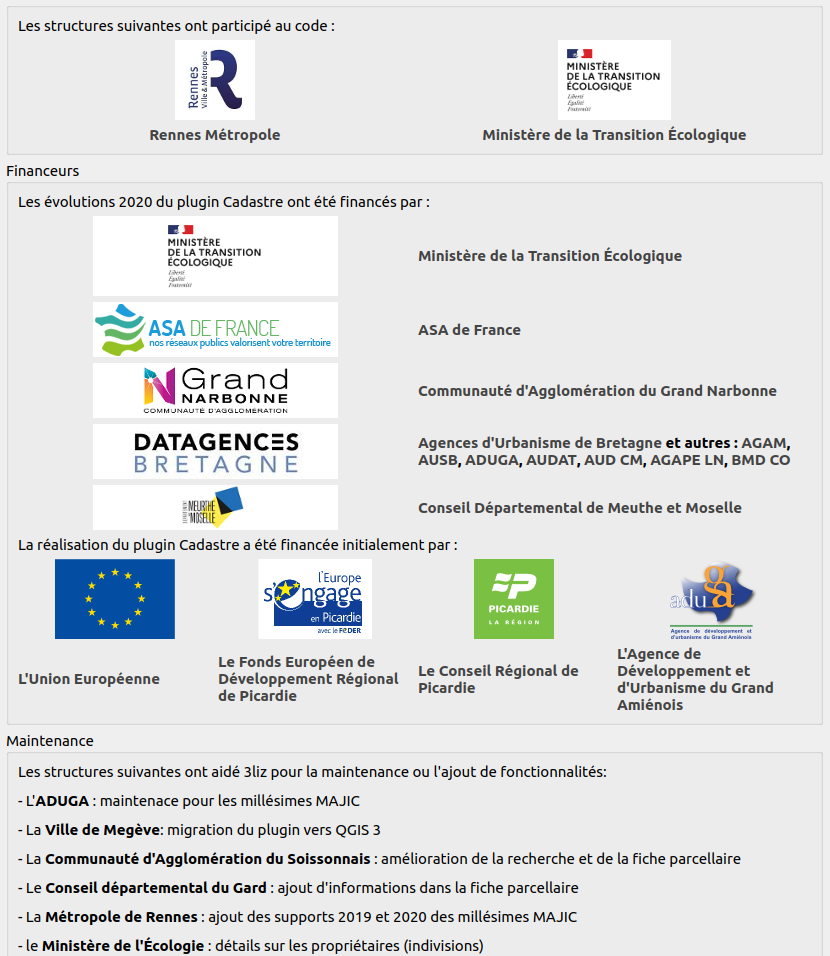
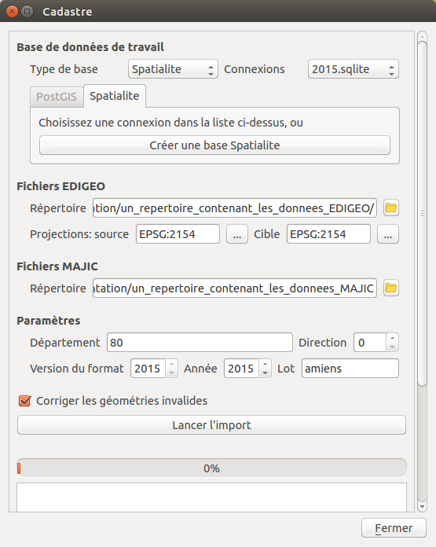
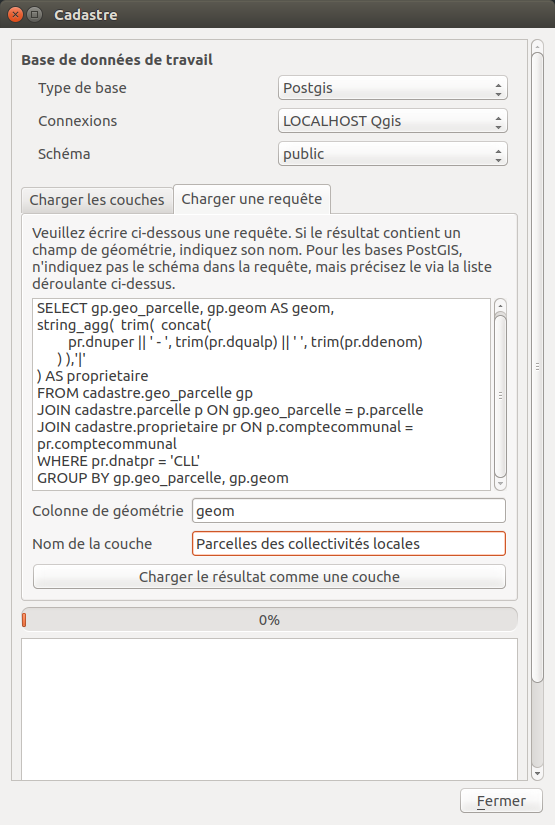
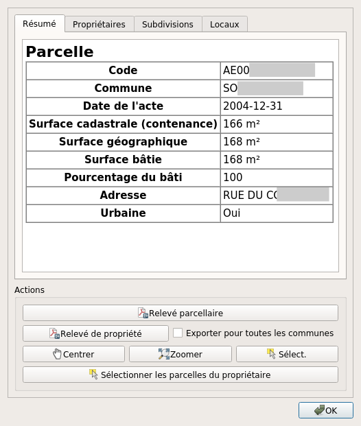
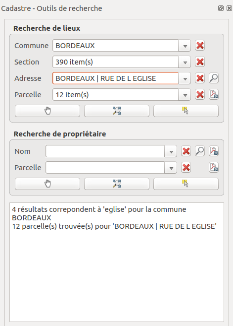

---
Title: Cadastre
Favicon: icon.png
...

# Plugin Cadastre - Documentation utilisateur

**Auteurs** Michaël DOUCHIN - 3liz
**Résumé** Ce document contient la documentation du plugin Cadastre pour le logiciel QGIS.



## Installation

Le plugin Cadastre est dans les dépôts officiels du projet QGIS. Pour l'installer, il faut :

* **Lancer QGIS**
* Menu **Extension > Installer/Gérer les extensions**
* Onglet **Paramètres** > Vérfier que la case *Afficher les extensions expérimentales* est bien cochée
* Onglet **En obtenir plus** : chercher le plugin **cadastre**, le sélectionner et cliquer sur installer

Une fois le plugin installé, un nouveau menu **Cadastre** apparaît dans le menu *Extensions* de QGIS. Il comporte les sous-menus suivants :

* **Importer des données**
* **Charger des données**
* **Outils de recherche**
* **Exporter la vue**
* **Configurer le plugin**
* **À propos**
* **Notes de version**
* **Aide**

Ces sous-menus sont détaillés dans les chapitres suivants.

## Configurer le plugin

Avant d'importer les premières données cadastrales dans la base de données, il faut au préalable configurer le plugin :

* Menu **Cadastre > Configurer le plugin** ou **icône outils** de la barre d'outil Cadastre


### Interface

Les 2 boutons **Interface Cadatre** et **Interface QGIS** permettent d'ouvrir une aide pour appliquer une interface simplifiée adaptée à une utilisation de consultation du Cadastre.

A ce jour, QGIS ne permet pas de modifier dynamiquement l'interface via un plugin. Nous incorporerons cette fonctionnalité lorsque ce sera possible. En attendant, il faut donc le faire manuellement, comme expliqué dans la fenêtre d'aide.

### Nom des fichiers MAJIC

Cette partie permet de spécifier comment sont appelés les fichiers MAJIC sur votre poste de travail. En effet, les conventions de nommage peuvent changer d'un département à l'autre. Souvent, les fichiers se terminent par une extension relative au département et à la direction, par exemple .800 pour les fichiers du département de la Somme.

**Il est important de bien configurer ces noms de fichiers avant votre premier import.**

Si le plugin ne trouve pas les fichiers MAJIC pendant l'import, alors que vous aviez spécifié le bon répertoire d'import, un message vous avertira et vous proposera d'annuler l'import.

### Modèle de composition pour l'export de la vue cartographique

Vous pouvez choisir ici le modèle de composeur d'impression qui sera utilisé dans la fonction **Export la vue**. Un modèle est fourni dans le répertoire *composeur* du plugin, et sera utilisé si vous ne proposez pas le votre.

Pour l'instant, le modèle gère un bloc de carte, mais pas les blocs de table attributaire.

### Répertoire temporaire

Vous pouvez choisir le répertoire dans lequel les scripts seront copiés, et les fichiers décompressés. Choisisez un répertoire contenant assez de place pour stocker les fichiers temporaires, surtout si vous souhaitez charger des données volumineuses.

Ce répertoire est aussi celui dans lequel les **relevés parcellaires** et les **relevés de propriété** seront exportés.


### Performances

Vous pouvez modifier dans ce groupe les options suivantes pour adapter le plugin aux performances de votre matériel :

* **Taille maximum des requêtes INSERT** : C'est le nombre total de requêtes INSERT lancées dans un groupe de modification ( BEGIN/COMMIT) . Vous pouvez baisser le chiffre jusqu'à 10000 si vous avez une machine légère et un gros volume de données à importer. Plus le chiffre est bas, plus l'import initial peut prendre du temps.

* **Stockage temporaire** : Le mode *MEMORY* est plus rapide, mais nécessite assez de mémoire vive pour stocker les données à traiter. Le mode *DEFAULT* est plus lent et adapté à des ordinateurs avec peu de mémoire vive.


## Importer des données

Cette boite de dialogue permet de réaliser un **import de données EDIGEO et MAJIC**.




### Principe

Le plugin permet l'import de données **MAJIC de 2012 à 2020 et des données EDIGEO** . Il est possible d'importer des données de manière incrémentale, **étape par étape**, ou bien d'importer **en une seule fois**.

Le plugin utilise pour cela la notion de **lot**. Un lot regroupe un **ensemble de données cohérent** pour votre utilisation. Par exemple, le lot peut être le code d'une commune, ou l'acronyme d'une communauté de commune. C'est une chaîne de 10 caractères maximum. Vous pouvez utiliser des chiffres ou des lettres.

Vous pouvez par exemple importer les données dans cette ordre :

* données EDIGEO de la commune A, lot "com_a"
* données EDIGEO de la commune B, lot "com_b"
* données MAJIC de la commune A, lot "com_a"
* données EDIGEO de la commune A, lot "com_a" (réimport et écrasement des données précédentes)
* données EDIGEO de la commune C, lot "com_c"

Il est donc important de conserver une liste des lots définis pendant les imports successifs, pour savoir ensuite quel lot utiliser si on souhaite écraser des données. Une version prochaine du plugin pourra intégrer un tableau récapitulatif des imports effectués dans une base de données pour faciliter le suivi des imports réalisés.


>Il est conseillé d'importer des données de millésime différents dans des bases de données ou des schémas PostGreSQL différents, car la structure peut changer d'un millésime à l'autre ( ajout de colonnes, modification de longueur de champs, etc.

### Bases de données

Deux **Systèmes de Gestion de Bases de Données** (SGBD) sont supportés par le plugin Cadastre :

* **PostGreSQL** et son extension spatiale **PostGIS**
* **Sqlite** et son extension spatiale **Spatialite**

Nous conseillons d'utiliser PostGreSQL pour des données volumineuses et pour gérer des accès multiples à la base de données.

Pour les bases de données **PostGIS**, il faut :

* avoir créé **une base de données** sur laquelle on a les droits en écriture, et activer l'extension PostGIS.
* avoir créé au préalable **une connexion QGIS** via le menu **Couches > Ajouter une couche PostGIS** vers cette base de données

Pour les bases de données **Spatialite**, l'interface d'import permet de créer une base de données vide et la connexion QGIS liée si nécessaire.

### Les étapes d'importation

Pour lancer l'importation, il faut bien avoir au préalable configuré les noms des fichiers MAJIC via le menu **Configurer le plugin**. Ensuite, on ouvre la boite de dialogue

* via la **barre d'outil Cadastre** , icône base de données
* via le menu **Cadastre > Importer des données**

On configure ensuite les options :

* Choisir **le type de base de données** : PostGIS ou Spatialite
* Choisir **la connexion**

    - Pour Postgis, on peut ensuite **choisir un schema**, ou en **créer un nouveau**
    - Pour Spatialite, on peut **créer une nouvelle base de données**

* Choisir le répertoire contenant les **fichiers EDIGEO** :

 - On peut sélectionner le **répertoire parent** qui contient l'ensemble des sous-répertoires vers les communes : le plugin ira chercher les fichiers de manière récursive.
 - seuls les fichiers **zip** et **tar.bz2** sont pour l'instant gérés

* Choisir la **projection source** des fichiers EDIGEO et la **projection cible** désirée

* Choisir le **numéro du Département**, par exemple : 80 pour la Somme
* Choisir le **numéro de la Direction**, par exemple: 0

* Choisir le répertoire contenant **les fichiers MAJIC**

    - Comme pour EDIGEO, le plugin ira chercher les fichiers dans les répertoires et les sous-répertoires et importera l'ensemble des données.
    - Si vous ne possédez pas les données FANTOIR dans votre jeu de données MAJIC, nous conseillons vivement de les télécharger et de configurer le plugin pour donner le bon nom au fichier fantoir : https://www.collectivites-locales.gouv.fr/mise-a-disposition-gratuite-fichier-des-voies-et-des-lieux-dits-fantoir

* Choisir la **version du format** en utilisant les flèches haut et bas

    - Seuls les formats de 2012 à 2020 sont pris en compte

* Choisir le **millésime des données**, par exemple 2020

* Choisir le **Lot** : utilisez par exemple le code INSEE de la commune.

* Activer ou désactiver la case à cocher **Corriger les géométries invalides** selon la qualité de votre jeu de données EDIGEO.

* Utiliser la barre de défilement de la fenêtre pour aller tout en bas et afficher tout le bloc texte de log situé sous la barre de progression.

* Lancer l'import en cliquant sur le bouton **Lancer l'import**


Le déroulement de l'import est écrit dans le bloc texte situé en bas de la fenêtre.

>Pendant l'import, il est conseillé de ne pas déplacer ou cliquer dans la fenêtre. Pour l'instant, le plugin n'intègre pas de bouton pour annuler un import en cours.


### Projections IGNF

Si votre donnée EDIGEO est en projection IGNF, par exemple pour la Guadeloupe, IGNF:GUAD48UTM20 (Guadeloupe Ste Anne), et que vous souhaitez importer les données dans PostgreSQL, il faut au préalable ajouter dans votre table public.spatial_ref_sys la définition de la projection IGNF. Si vous utilisez à la place l'équivalent EPSG (par exemple ici EPSG:2970), vous risquez un décalage des données lors de la reprojection.

Vous pouvez ajouter dans votre base de données la définition via une requête, par exemple avec la requête suivante pour IGNF:GUAD48UTM20:

```
INSERT INTO spatial_ref_sys values (
    998999,
    'IGNF',
    998999,
    'PROJCS["Guadeloupe Ste Anne",GEOGCS["Guadeloupe Ste Anne",DATUM["Guadeloupe St Anne",SPHEROID["International-Hayford 1909",6378388.0000,297.0000000000000,AUTHORITY["IGNF","ELG001"]],TOWGS84[-472.2900,-5.6300,-304.1200,0.4362,-0.8374,0.2563,1.898400],AUTHORITY["IGNF","REG425"]],PRIMEM["Greenwich",0.000000000,AUTHORITY["IGNF","LGO01"]],UNIT["degree",0.01745329251994330],AXIS["Longitude",EAST],AXIS["Latitude",NORTH],AUTHORITY["IGNF","GUAD48GEO"]],PROJECTION["Transverse_Mercator",AUTHORITY["IGNF","PRC0220"]],PARAMETER["semi_major",6378388.0000],PARAMETER["semi_minor",6356911.9461],PARAMETER["latitude_of_origin",0.000000000],PARAMETER["central_meridian",-63.000000000],PARAMETER["scale_factor",0.99960000],PARAMETER["false_easting",500000.000],PARAMETER["false_northing",0.000],UNIT["metre",1],AXIS["Easting",EAST],AXIS["Northing",NORTH],AUTHORITY["IGNF","GUAD48UTM20"]]',
    '+init=IGNF:GUAD48UTM20'
);
```

Attention, il est important d'utiliser un code qui est <= 998999, car PostGIS place des contraintes sur le SRID. Nous avons utilisé ici 998999, qui est le maximum possible.
La liste des caractéristiques des projections peut être trouvée à ce lien : http://librairies.ign.fr/geoportail/resources/IGNF-spatial_ref_sys.sql ( voir discussion Géorézo : https://georezo.net/forum/viewtopic.php?pid=268134 ). Attention, il faut extraire de ce fichier la commande INSERT qui correspond à votre code IGNF, et remplacer le SRID par 998999.

Ensuite, dans la projection source, vous pouvez utiliser IGNF:GUAD48UTM20 au lieu du code EPSG correspondant.

## Charger des données

Une fois les données importées dans la base, vous pouvez les importer dans QGIS via le menu **Charger les données**.


### Base de données de travail

Il faut d'abord indiquer au plugin où récupérer les données:

* Choisir le **type de base** de données
* Choisir ensuite **la connexion** vers la base de donnée dans lequel l'import a été fait
* Si PostGIS, choisir **le schéma** contenant les données

### Thème

Puis on choisir un **thème** à utiliser pour la symbologie des couches:

* **Classique** : un thème proche du rendu de cadastre.gouv.fr
* **Orthophoto** : un thème adapté à un affichage par dessus un fond orthophoto.

### Couches et filtres

* En cochant la case **Ajouter seulement Commune, sections, parcelles et bâti**, vous indiquez que vous souhaitez ouvrir seulement ces couches dans QGIS (et pas les autres couches comme les bornes, les croix, etc.)

* **Filtrer par expression sur les communes** : cette option vous permet de ne pas charger la totalité des données, mais seulement celles qui correspondent aux communes filtrées via une expression. Vous devez connaître la structure de la table **geo_commune** pour pouvoir réaliser ce filtre. Si l'expression est invalide, alors le plugin chargera l'ensemble des données.

Attention à cette 2ème option, qui est expérimentale, et qui peut poser des souci de performance. Pour information, cette option ajoute un filtre à chaque couche via une sous-requête. Une fois les couches chargées, vous pouvez consulter ce filtre via l'onglet *Général* de la boîte de dialogue des propriétés de chaque couche.

Exemples d'expression:

* **substr("geo_commune", 5, 6) LIKE '54033%'**  -> les communes du département 54, direction 0 , dont le code INSEE commence par 33
* **"tex2" IN ('AMIENS', 'ALLONVILLE')** -> le nom de la commune est AMIENS ou ALLONVILLE


### Notes

Pensez à **enlever les données cadastrales existantes dans votre projet QGIS** : Le plugin ne sait pas gérer la recherche et l'interrogation de données si on a plus qu'une version des couches parcelles, communes et sections dans le projet QGIS.

Enfin, cliquez sur le bouton **Charger les données** pour lancer le chargement.

### Charger une couche à partir d'un requête.

L'onglet **Charger une requête** vous donne la possibilité d'utiliser une requête SQL pour récupérer des données de la base. Pour cela, il faut bien connaître le modèle de la base de données, et les spécificités des données MAJIC. Cette fonctionnalité vise à évoluer pour proposer une liste de requêtes intéressantes pour l'exploitation des données cadastrales.



Une fois la connexion choisie, vous pouvez écrire le texte SQL dans le champ texte.

* La requête peut renvoyer des données spatiales ou seulement des données attributaires.
* Si un des champs retournés est une géométrie, vous devez spécifier son nom dans le champ texte dédié.
* Si vous utilisez une connexion PostGIS, il faut préfixer les tables avec le nom du schéma. Par exemple `cadastre.geo_parcelle`.

La requête suivante retourne par exemple pour chaque code de parcelle la date de l'acte (on suppose que le schéma est cadastre). Vous pouvez ensuite utiliser une jointure QGIS pour faire le lien avec la couche Parcelles:

```
SELECT p.parcelle, p.jdatat AS date_acte
FROM cadastre.parcelle p
```

La requête suivante renvoit toutes les parcelles appartenant à des collectivités locales, avec la géométrie et les noms des propriétaires

```
SELECT gp.geo_parcelle,
string_agg(
   trim(
      concat(
         pr.dnuper || ' - ',
         trim(pr.dqualp) || ' ',
         trim(pr.ddenom)
      )
   ),'|'
) AS proprietaire,
gp.geom AS geom
FROM cadastre.geo_parcelle gp
JOIN cadastre.parcelle p ON gp.geo_parcelle = p.parcelle
JOIN cadastre.proprietaire pr ON p.comptecommunal = pr.comptecommunal
WHERE pr.dnatpr = 'CLL'
GROUP BY gp.geo_parcelle, gp.geom
```


## La barre d'outil Cadastre


La barre d'outil peut s'afficher ou se masquer à partir :

* du menu **Vue > Barres d'outils > Cadastre**
* d'un clic droit à côté d'une des barres d'outils de QGIS, et sélectionner **Cadastre**

Elle contient :

* Un outil pour **identifier une parcelle** sur la carte
* Des boutons qui reprennent les sous-menus du plugin : Importer, Charger, Rechercher, Exporter la vue, Configurer, A propos

Pour connaître l'action d'une des icônes, il suffit de laisser la souris un moment au-dessus pour voir apparaître une bulle d'information.


### Indentifier une parcelle


Pour avoir des informations complètes sur une parcelle, il faut avoir au préalable importé des données MAJIC dans la base de données. Sinon, seules les informations principales issues de l'EDIGEO seront affichées et certains boutons d'action sont désactivés.

Pour faire apparaître la fiche d'information d'une parcelle, il faut:

* activer l'outil **Identifier une parcelle** de la barre d'outil
* **Zoomer à une échelle** pour laquelle les parcelles sont visibles (à partir de 1/20 000).
* **Cliquer sur une des parcelles** de la carte.

La fenêtre d'identification s'affiche alors,



Elle présente plusieurs onglets:

* un onglet avec les **informations générales de la parcelle**
* un onglet avec les **propriétaires** de la parcelle
* un onglet avec les **subdivisions fiscales**
* un onglet avec les **locaux** et leurs informations détaillées

ainsi qu'une zone contenant des **boutons d'action**:

  - 2 boutons pour **exporter** le **relevé parcellaire** et le **relevé de propriété** au format PDF
  - 3 boutons pour **interargir avec l'objet géométrique** lié à la parcelle : centrer la carte sur la parcelle, zoomer sur la parcelle, ou sélectionner l'objet dans la couche
  - Un dernier bouton pour **sélectionner dans la couche toutes les parcelles du propriétaire**
 


>Si vous n'avez pas importé de données FANTOIR, la commune de la parcelle ne sera pas affichée dans la fenêtre et l'adresse pourra être tronquée (de même pour les relevés exportés)

>Si vous n'avez pas de données MAJIC, seule les informations sur la parcelle (1er onglet) seront présentées.


### Exporter la vue

Dans la barre d'outil Cadastre, ainsi que dans le menu, vous pouvez exporter la vue courante de la carte en PDF via le menu **Exporter la vue**.

Cette fonctionnalité s'appuie sur un **modèle de composeur d'impression**, configurable dans les options du plugin (voir ci-dessus). Si vous n'avez pas configuré de composeur personnalisé, celui installé par le plugin est utilisé.

>Cette fonctionnalité est basique, et ne gère pas pour l'instant les composeurs complexes, avec des tables attributaires et des configurations d'atlas.


## Le panneau de recherche




### Principe

Le panneau de recherche propose des outils pour rechercher des parcelles via 3 entrées principales

* une recherche par **objet géographque** : commune, section, adresse et parcelles
* une recherche par **propriétaire**

Les différentes recherches seront détaillées dans les sous-chapitres suivants.

Pour afficher le panneau de recherche:

* Utiliser le menu **Cadastre > Outils de recherche** ou cliquer sur l'**icône loupe** de la barre d'outils

Une bulle d'information affiche la fonction des boutons au survol de la souris.

>Si la base de données ne contient aucune donnée MAJIC, alors les recherches par adresse et par propriétaire sont désactivés.


### Recherche de lieux

L'outil présente 3 listes déroulantes :

* **Commune**
* **Section**
* **Adresses**
* **Parcelles**

Il est possible de **sélectionner une entité** dans les listes:

* soit *à la souris* en cliquant sur la flèche pour ouvrir la liste déroulante puis sélectionner un item.
* soit en *tapant les premières lettres* et en sélectionnant l'item choisi dans la liste d'autocomplétion qui s'affiche alors. Il faut avoir au préalable vider le contenu de la liste déroulante.

Les listes déroulantes sont **hiérarchiques** :

* Lorsqu'on choisit une commune, la liste des sections est raffraîchie et ne montre que les sections de la commune choisie. La recherche d'adresse est aussi filtrée sur cette commune.
* lorsqu'on choisit une section, la liste des parcelles est raffraîchie et montre les parcelles sur la section.

Des **boutons d'actions** sont positionnés sous les 3 listes déroulantes et permettent de lancer l'action choisie sur le dernier objet sélectionné dans les 3 listes :

* *Centrer sur l'objet* : la carte est déplacée vers l'objet sélectionné, mais l'échelle est conservée
* *Zoomer sur l'objet* : la carte est déplacée et mise à l'échelle pour afficher l'objet sélectionné
* *Sélectionner l'objet* : l'objet est sélectionné dans la couche de données correspondante ( Communes, Sections ou Parcelles)

A côté des listes, un bouton **croix rouge** permet de remettre la liste à son état initial, c'est-à-dire sans objet sélectionné. Par exemple, si on avait sélectionné une commune dans la premier liste et une section dans la seconde, on peut cliquer sur la croix rouge à côté de la section pour désélectionner la section dans la liste. Ainsi si on utilise le bouton de Zoom, on zoomera sur la commune et non sur la section qui était précédemment sélectionnée

Si une parcelle a été sélectionnée dans la liste **Parcelles**, il est possible d'**exporter le relevé parcellaire** en cliquant sur le bouton *icône PDF* situé en bas à droite du bloc de recherche de lieux. Le **PDF est généré et ouvert** avec le lecteur PDF par défaut du système.


### Recherche d'adresse

>Pour l'instant, cet outil ne fonctionne que si des données MAJIC sont dans la base, et si les données FANTOIR ont été importées. Si vous ne possédez pas de données FANTOIR dans votre lot de données MAJIC, vous pouvez le télécharger pour votre département ici (et relancer l'import Majic): http://www.collectivites-locales.gouv.fr/mise-a-disposition-fichier-fantoir-des-voies-et-lieux-dits

Pour lancer une **recherche de parcelles par adresse**, il suffit:

* d'*entrer l'adresse cherchée*, sans le numéro de rue dans la liste **Adresse**.
* de cliquer sur le **bouton loupe** situé à côté de la liste, ou d'appuyer sur la **touche entrée**

La recherche est effectuée et la liste déroulante où vous avez tapé l'adresse à chercher est maintenant raffraîchie et contient l'ensemble des résultats trouvés. Si une commune était sélectionnée dans la liste des communes, la recherche d'adresse ne renvoit que les voies de cette commune.

Si des résultats ont été trouvés, on peut ensuite :

* **Sélectionner une adresse** dans la liste déroulante via la souris. Cela **raffraîchit la liste des parcelles** située en dessous.
* cliquer sur les boutons de **centrage, zoom et sélection** . Chaque action est lancée sur **l'ensemble des parcelles correspondantes** à l'adresse choisie
* Sélectionner une des parcelles dans la liste déroulante **Parcelles** et réutiliser les boutons d'action.
* Si une parcelle est sélectionnée, le bouton avec une icône PDF permet d'**exporter le relevé parcellaire** pour cette parcelle

Vous pouvez cliquer sur la croix rouge à côté de la recherche d'adresse pour désélectionner l'adresse choisie.

### Recherche de propriétaires

>Ce bloc de recherche ne fonctionne pas si aucune donnée MAJIC n'est présente dans la base

Le principe et le fonctionnement est le même que pour la recherche par adresse, avec les différences suivantes :

* Un bouton est ajouté à côté de la liste des propriétaire pour **exporter le relevé de propriété** du propriétaire sélectionné dans la liste
* Le bouton d'**export du relevé parcellaire** est placé à côté de la liste *Parcelles*

Il est possible d'exporter le relevé de propriété pour les personnes qui ne possèdent pas de propriété non bâtie.


### Utilisation du plugin QuickFinder pour chercher les parcelles

Vous pouvez installer le plugin QuickFinder pour préparer et utiliser des recherches sur différentes couches cadastrales. Exemple de configuration intéressante:

* Ouvrir la boîte de dialogue de configuration du plugin: *Menu Extensions / QuickFinder / Settings*
* Aller à l'onglet *Project Search*
* Cocher la case *Search in project layers*
* A côté du champ *QuickFinder file*, cliquer sur le bouton avec une icône "page" pour créer un nouveau fichier (en anglais, au survol du  bouton: *Create a new QuickFinder file* ). Enregistrer le fichier dans le répertoire du projet QGIS, et lui donner le même nom de fichier (par exemple "cadastre.qfts" pour un projet QGIS "cadastre.qgs")
* Cliquer sur le bouton "+" en vert pour ajouter une nouvelle recherche: cela ouvre une boite de dialogue *project search*. Configurer une recherche pour les parcelles:
  - *Search name* : Parcelles
  - *Layer*: Parcelles
  - *Field* : vous pouvez utiliser un champ, ou mieux une expression QGIS pour concaténer des informations, en cliquant sur le bouton "epsilon", par exemple:
  ```sql
  Concat(
    'COM ', "codecommune", ' / ',
    'SEC ', substr("idu", 7, 2), ' / ',
    'PAR ', substr("idu", 9, 4), ' / ',
    'ADR ', "adresse", ' / ',
    '', "proprietaire",
    ' @@', "codecommune"
  )
  ```
  ( la partie avec @@ et le codecommune à la fin sont utiles si vous publiez le cadastre sur internet vers l'application Lizmap. Cela permet de filtrer les données )
  - *Geometry storage*: wkt
  - *Priority*: 1
  - *record entries*: laisser coché, cela va lancer la création des données de recherche et leur stockage dans le fichier QuickFinder

Une fois cette configuration effectuée, vous pouvez fermer les fenêtres QuickFinder, puis utiliser la barre d'outil QuickFinder pour chercher des parcelles via leur code, le code commune, le code de section, ou bien le nom des propriétaires.

## À propos

Le menu **Cadastre > A propos** ouvre une fenêtre d'information sur le plugin Cadastre : financeurs, auteur, licence, dépôt de sources, etc.

Cette fenêtre est automatiquement affichée lors de la première utilisation du plugin, mais pas les fois suivantes.

## Notes de version

Le menu **Cadastre > Notes de version** ouvre une fenêtre qui montre les changements effectués sur le plugin Cadastre entre la version installée et la version précédente. Cette fenêtre est affichée automatiquement une première fois lors de la montée de version.


## Vidéos de démonstration

Pour faciliter la prise en main, vous pouvez consulter les vidéos en ligne :

* Import et chargement : https://vimeo.com/75004889
* Recherche : https://vimeo.com/74807532


## Modèle de données

Le lien suivant permet de voir comment sont organisées les données cadastrales dans la base de données (tables, contraintes, etc.): https://3liz.github.io/QgisCadastrePlugin-documentation/index.html

Pour plus d'informations, voir le dépôt des sources de la documentation: https://github.com/3liz/QgisCadastrePlugin-documentation

### Les parcelles

Dans le modèle, plusieurs tables contiennent des informations sur les parcelles

* **geo_parcelle** : contient les parcelles EDIGEO

* **parcelle** : contient les données MAJIC liées au parcelles cadastrales

* **parcelle_info**: contient une version consolidée des parcelles EDIGEO et MAJIC: la géométrie EDIGEO, et les informations résumées de la parcelle, dont les propriétaires ( information séprées par la barre verticale | si la parcelle a plusieurs propriétaires )

Les champs parcelle.parcelle et geo_parcelle.geo_parcelle peuvent être utilisés pour les jointures entre la table parcelle et la table geo_parcelle

L'identifiant **geo_parcelle** (ou parcelle) est unique et constitué comme suit :
*Année (4) + Département (2) + Direction (1) + Commune (3) + Préfixe (3) + Secteur (2) + Numéro de plan (4)*
soit **19 caractères**


