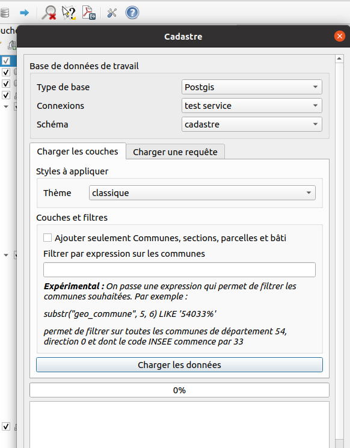
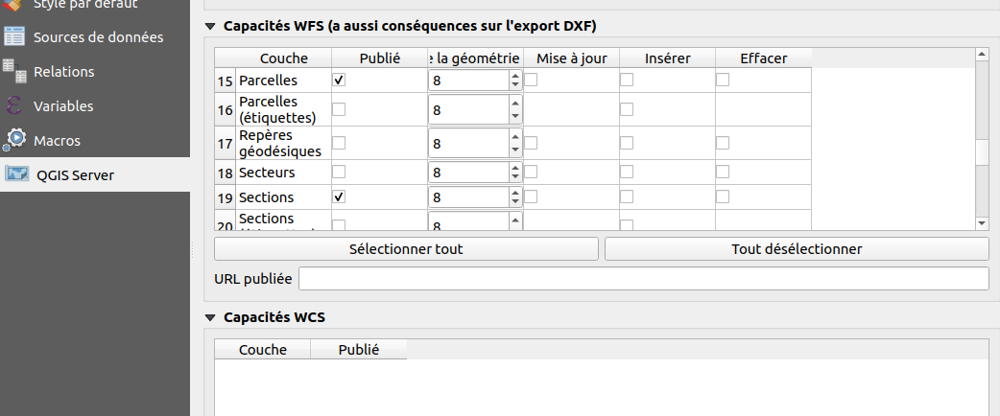
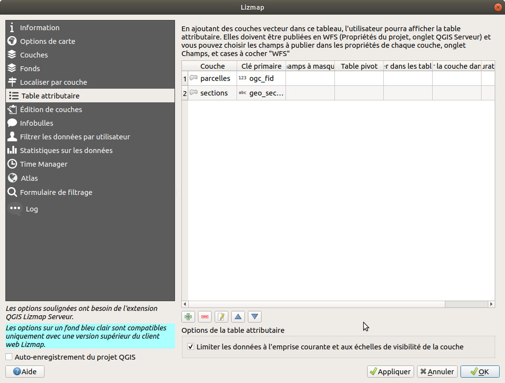

# Configuration

## Dans QGIS

### Configurer le projet QGIS

Pour utiliser le module cadastre dans **Lizmap Web Client** il vous faut d'abord configurer un **projet QGIS**:

* Vous aurez besoin d'installer l'extension QGIS [Cadastre](https://github.com/3liz/QgisCadastrePlugin)
sur votre QGIS Bureautique via le gestionnaire d'extensions, ainsi que sur votre serveur QGIS Server
dans un dossier nommé `cadastre`.

* Il faut ensuite créer un projet QGIS contenant les données cadastrales, et le configurer
avec l'extension **Cadastre**:

    - Utilisez l'outil de **chargement des couches**, il configurera notamment les **variables** dans le projet
  ainsi que les couches requises.

    

    - Dans les **propriétés du projet**, onglet `QGIS Server`, il faut publier en WFS les couches
  `Communes`, `Parcelles` et `Sections`.

    

### Configurer la publication avec le plugin Lizmap

Vous devez maintenant créer ou modifier la configuration **lizmap** via le plugin Lizmap pour QGIS:

* Il faut obligatoirement ajouter la couche `Parcelles` dans l'onglet **table attributaire**.

    - Pour les performances, pensez à cocher la case "Limiter les données à l'emprise courante" en bas de la fenêtre pour l'onglet table attributaire

    - Pour les performances, vous pouvez aussi cocher "Masquer la couche dans la liste" pour la configuration de la couche Parcelles. La fonction de sélection sera active mais la couche Parcelles n'apparaîtra pas dans la liste des table attributaires disponibles.

* La couche `Parcelles` ne doit pas être dans un groupe qui a l'option `Groupe comme une couche` activée
dans l'onglet `Couches` de Lizmap.

* Vous devez activer la **popup** pour la couche des `Parcelles`, via l'onglet `Couches` du plugin Lizmap.
**ATTENTION** Selon le public visé, vous devrez adapter les champs visibles dans la popup de Lizmap,
notamment les champs `proprietaire` et `proprietaire_infos` qui contiennent des données sensibles issues
des fichiers MAJIC.

    - Si vous utilisez la popup **Auto** de Lizmap, désactiver le WMS pour les champs souhaités dans l'onglet
    `Champs` des propriétés de la couche (tout à droite du tableau)

    - Si vous utilisez la popup **QGIS**, adaptez la configuration en supprimant le contenu HTML non souhaité,
    visible dans l'onglet `Affichage` (ou `Infobulle`) des propriétés de la couche, groupe `Infobulle HTML`

* A noter que depuis la version **1.6.0** du module Cadastre, lorsque l'utilisateur a
**le droit de voir les données de propriétaires**, le contenu détaillé des informations de la parcelle est
**affiché sous le contenu de la popup**. Les onglets correspondent à ceux visibles dans QGIS lorsqu'on
affiche le détail d'une parcelle: **Parcelle, Propriétaires, Subdivisions fiscales, Locaux,
Locaux : informations détaillées**. Vous pouvez donc afficher moins d'information dans la popup,
par exemple seulement le code de la parcelle et la commune

## Dans Lizmap Web Client

Maintenant vous devez configurer les droits d'accès à l'outil via l'interface d'administration.
Le module a créé:

* un groupe d'utilisateurs `Cadastre Lizmap` (identifiant `cadastre_lizmap`)
* 2 sujets de droit : `Accéder aux données de propriétaires` et `Utiliser le panneau de recherche`

Vous pouvez mettre certains utilisateurs dans ce groupe `Cadastre Lizmap`. Ils auront alors accès
au panneau de recherche par localisation **ET** par nom de propriétaires. **Vous devez bien faire
attention de n'accorder le droit `Accéder aux données de propriétaires` qu'aux personnes habititées !**.

Vous pouvez modifier plus finement les droits via le bouton `Changer les droits des groupes` situés
dans le menu `Groupes d'utilisateurs pour les droits` de l'interface d'administration de Lizmap Web Client.
*Attention, cette page modifie fortement les droits par défaut des groupes d'utilisateurs.
Nous conseillons de ne pas touchez aux droits liés à Lizmap ici, sauf si vous maîtrisez ce que vous faites.*
